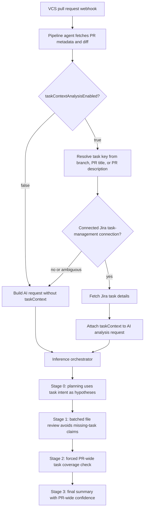

# CodeCrow

**CodeCrow** is an enterprise-grade, AI-powered code review platform designed to automate the security and quality analysis of your pull requests and branches. By combining large language models with a Retrieval-Augmented Generation (RAG) pipeline, CodeCrow understands your entire codebase, providing deep, context-aware feedback directly in your VCS platform.
Fully self-hosted with no restrictions: <a href="https://codecrow.app/docs/self-host">Docs</a>

## Capabilities by Platform

CodeCrow supports multiple version control systems. The AI analysis engine is the same across all platforms — the differences are in how results are surfaced in each VCS.

### Analysis & Review

| Feature                  | Bitbucket | GitHub | GitLab |
| :----------------------- | :-------: | :----: | :----: |
| PR / MR Analysis         |    ✅     |   ✅   |   ✅   |
| Branch Analysis (push)   |    ✅     |   ✅   |   ✅   |
| Continuous Analysis      |    ✅     |   ✅   |   ✅   |
| Incremental / Delta Diff |    ✅     |   ✅   |   ✅   |
| RAG-Augmented Review     |    ✅     |   ✅   |   ✅   |
| Jira Task Context Review |    ✅     |   ✅   |   ✅   |

### PR / MR Comment Integration

| Feature                            |     Bitbucket     | GitHub | GitLab |
| :--------------------------------- | :---------------: | :----: | :----: |
| PR Summary Comment                 |        ✅         |   ✅   |   ✅   |
| Inline Diff Comments               | via Code Insights |   ✅   |   ✅   |
| Code Insights Report + Annotations |        ✅         |   —    |   —    |
| Check Runs                         |         —         |   ✅   |   —    |
| Threaded Comment Replies           |        ✅         |   —    |   ✅   |
| Placeholder While Analyzing        |        ✅         |   ✅   |   ✅   |

### Slash Commands (in PR comments)

| Command           | Bitbucket | GitHub | GitLab |
| :---------------- | :-------: | :----: | :----: |
| `/ask <question>` |    ✅     |   ✅   |   ✅   |
| `/analyze`        |    ✅     |   ✅   |   ✅   |
| `/summarize`      |    ✅     |   ✅   |   ✅   |
| `/qa-doc`         |    ✅     |   ✅   |   ✅   |

### Dashboard & Issue Management

These features are platform-independent and available through the CodeCrow web UI.

| Feature                     | Description                                                                    |
| :-------------------------- | :----------------------------------------------------------------------------- |
| Issue Tracker               | Per-branch and per-PR issue lists with severity, category, and status filters  |
| Issue Lifecycle             | Automatic resolution tracking across analyses; manual resolve/reopen           |
| Source Context Viewer       | Full source code browser with inline issue annotations for every analyzed file |
| Quality Gates               | Configurable pass/fail thresholds per workspace                                |
| Custom Rules                | Per-project enforce/suppress rules with glob-based file patterns               |
| Project Analytics           | Aggregated severity breakdown, analysis history, and branch health             |
| AI Model Selection          | Choose your LLM provider and model (OpenRouter, Anthropic, Google, OpenAI)     |
| Workspace & Team Management | Roles (Owner, Admin, Member, Viewer), member invites, ownership transfer       |
| Task Management (Jira)      | Connect Jira Cloud to link PRs with tasks for QA documentation, task-aware review, and comment sync |
| QA Auto-Documentation       | AI-generated QA docs stored per PR in CodeCrow and posted as Jira comments     |
| Two-Factor Authentication   | TOTP-based 2FA for sensitive operations                                        |

### Setup Methods

| Method             |  Bitbucket   |     GitHub      | GitLab |
| :----------------- | :----------: | :-------------: | :----: |
| Native App Install | ✅ (Connect) | ✅ (GitHub App) |   —    |
| Manual Webhook     |      ✅      |       ✅        |   ✅   |
| CI Pipeline Action |      ✅      |        —        |   —    |

---

## Supported Languages

CodeCrow's AI review is **language-agnostic** — it analyzes any language or framework the underlying LLM can understand. No special configuration is required.

The RAG pipeline (codebase indexing for context-aware reviews) provides enhanced support for languages with dedicated AST parsers. All other text-based files are indexed using a generic chunker.

| Language                 | AI Review | RAG (AST) | Notes                                             |
| :----------------------- | :-------: | :-------: | :------------------------------------------------ |
| Java                     |    ✅     |    ✅     | incl. Spring, Jakarta EE, Android                 |
| Kotlin                   |    ✅     |    ✅     | incl. Android, Ktor                               |
| Python                   |    ✅     |    ✅     | incl. Django, Flask, FastAPI                      |
| JavaScript               |    ✅     |    ✅     | incl. React, Vue, Svelte, Node.js                 |
| TypeScript               |    ✅     |    ✅     | incl. Angular, Next.js, Deno                      |
| Go                       |    ✅     |    ✅     |                                                   |
| Rust                     |    ✅     |    ✅     |                                                   |
| C                        |    ✅     |    ✅     |                                                   |
| C++                      |    ✅     |    ✅     |                                                   |
| C#                       |    ✅     |    ✅     | incl. .NET, ASP.NET, Unity                        |
| PHP                      |    ✅     |    ✅     | incl. Laravel, Symfony                            |
| Ruby                     |    ✅     |    ✅     | incl. Rails                                       |
| Swift                    |    ✅     |    ✅     | incl. iOS / macOS                                 |
| Scala                    |    ✅     |    ✅     |                                                   |
| Lua                      |    ✅     |    ✅     |                                                   |
| Perl                     |    ✅     |    ✅     |                                                   |
| Haskell                  |    ✅     |    ✅     |                                                   |
| COBOL                    |    ✅     |    ✅     |                                                   |
| Objective-C              |    ✅     |     —     |                                                   |
| Bash / Shell             |    ✅     |     —     |                                                   |
| SQL                      |    ✅     |     —     |                                                   |
| R                        |    ✅     |     —     |                                                   |
| HTML / CSS / SCSS        |    ✅     |     —     |                                                   |
| Vue / Svelte SFCs        |    ✅     |     —     |                                                   |
| YAML / TOML / JSON / XML |    ✅     |     —     | config files, IaC                                 |
| Markdown / RST           |    ✅     |     —     | documentation                                     |
| _Any other language_     |    ✅     |  generic  | LLM-dependent; no AST, uses text chunking for RAG |

> **Framework-specific?** The review quality scales with the LLM's knowledge of the framework. Popular frameworks (React, Spring Boot, Django, Rails, Laravel, .NET, etc.) get high-quality, idiomatic feedback out of the box. Niche frameworks work too — the LLM simply has less training data to draw on.

## Key Features

- **Context-Aware Reviews**: Powered by a custom RAG (Retrieval-Augmented Generation) pipeline using Qdrant vector storage.
- **Task-Aware PR Review**: When a project has a connected Jira task-management integration, PR analysis can include the linked task summary, description, status, priority, assignee, reporter, and URL. The setting `taskContextAnalysisEnabled` defaults to `true` and can be disabled per project through analysis settings.
- **Incremental Analysis**: Only scans changed code to keep feedback fast and cost-efficient.
- **Multi-Tenant Architecture**: Securely manage multiple teams and projects from a single dashboard.
- **Interactive Commands**: Command CodeCrow directly from PR comments using `/ask`, `/analyze`, `/summarize`, and `/qa-doc`.
- **QA Auto-Documentation**: Automatically generate QA testing documentation from PR analysis, store the latest document per PR in the CodeCrow dashboard, and post or update it on linked Jira tickets. Task IDs are auto-detected from branch names, PR titles, or PR descriptions — or you can specify one explicitly with `/qa-doc PROJ-123`.
- **Issue Lifecycle**: Automatic tracking of resolved vs. open issues across analyses with deterministic and AI-based reconciliation.
- **Bring Your Own Model**: Connect your preferred LLM provider — OpenRouter, Anthropic, Google, OpenAI, or any OpenAI-compatible endpoint (vLLM, Ollama, Cloudflare Workers AI, etc.).

## Documentation

For full setup guides, architectural deep-dives, and API reference, please visit our documentation portal:

👉 [**codecrow.cloud/docs**](https://codecrow.app/docs/getting-started)

---

## Architecture at a glance

High level components:

- **Web frontend** (`frontend/`) – React-based UI for workspaces, projects, dashboards, and issue views.
- **Web server / API** (`java-ecosystem/services/web-server/`) – main backend API, auth, workspaces/projects, and orchestration.
- **Pipeline agent** (`java-ecosystem/services/pipeline-agent/`) – receives VCS webhooks, fetches repo/PR data, and coordinates analysis.
- **Inference Orchestrator** (`python-ecosystem/inference-orchestrator/`) – executes analyzers and calls LLMs using the Model Context Protocol.
- **RAG pipeline** (`rag-pipeline/`) – indexes code and review artifacts into **Qdrant** for semantic search.

### Task-aware PR analysis flow

Task context is optional and non-blocking. If a task cannot be found, Jira auth fails, the workspace has ambiguous task-management connections, or `taskContextAnalysisEnabled` is disabled, CodeCrow continues with normal code-only analysis.

The PR may still be reviewed in Stage 1 batches for token safety. Task coverage is not decided in those batches. If task context is present, Stage 2 receives a bounded PR-wide change summary plus all Stage 1 findings and is forced to run even in fast-check mode. That prevents a requirement from being reported as missing just because it was implemented in a later batch.

---

## Contributing
Contributions are welcome. Please see our [Development Guide](https://codecrow.app/docs/developer/dev-setup) for more information.

## License

This project is licensed under the [FSL-1.1-MIT (Functional Source License)](LICENSE). You can use, modify, and self-host it freely — the only restriction is that you may not use it to build a competing commercial code-review product. Every version automatically converts to a full MIT license two years after its release.

> **Note:** The hosted service (codecrow-cloud) is proprietary and not covered by this license.
