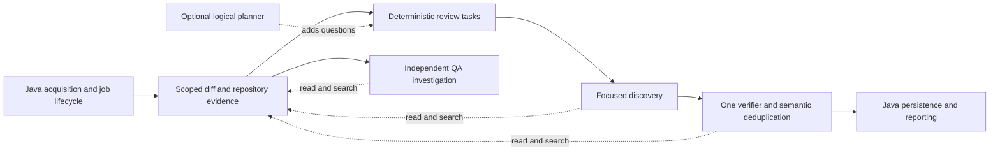

# Review quality roadmap

Status: proposed, not implemented. Read [investigation.md](investigation.md) for source evidence and research R1–R8; execute [tasks.md](tasks.md) phase by phase. Target baseline: `8dd96da2696340fc05c91baa73ef4121481bc805`.

## Intended result

Improve actionable-defect precision while preserving and extending cross-file recall. Measure both F1 and recall-weighted F2. Keep one review engine, a small repository evidence interface, and one verifier role. Restore an optional planner only if it adds demonstrated value beyond deterministic task allocation.

This document specifies future implementation. Do not rebuild/restart the active benchmark instance, change its model/provider/keys, overwrite its outputs, or run competing experiments against it. Implement in an isolated checkout when execution begins. No new API/schema release versions, agent teams, reporting service, policy gate framework, or mandatory repository execution is needed.

## Ownership and contracts

Keep `ReviewService` as a coordinator. Extract cohesive Python modules for evidence access, task allocation/prompt packing, discovery, and verification; do not introduce a generic workflow framework or inherit from QA's large orchestrator. QA consumes the evidence interface, not review findings as its sole input. Java continues to own provider authentication, authorized project/task lookup, persisted issue IDs, jobs, locks, and publication.

Shared evidence/task/decision shapes and Java/Python examples belong under `analysis-plugins/contracts/`; shared behavioral fixtures belong under `analysis-plugins/fixtures/`. Evolve existing request/issue DTOs through small adapters. Language and framework facts stay in their existing plugins. Neither host dispatches on a concrete language or imports its implementation. Empty registries, unsupported parsers, and failed optional contributions retain generic diff/source review.

Minimum data to preserve, without adding a persistence system for every internal record:

| Data | Required meaning |
| --- | --- |
| Review scope | Authorized workspace/project/repository, full PR diff, selected delta, source HEAD, target HEAD, actual diff-base revision, previous reviewed HEAD. Normalize provider identities where possible; unavailable optional identity yields reduced context, not automatic rejection. |
| Review task | Stable task ID, owned hunk/range IDs, one review question, related source/diff references, and cross-task dependencies. A planner can suggest questions, but cannot remove the host-owned changed-code worklist. |
| Evidence reference | Repository-relative path, side/revision, line range or graph unit, and completeness/continuation information. Existing receipts identify graph reads; they are not prerequisites for local diff-only analysis. |
| Candidate and decision | Stable request-local candidate ID, changed anchor, failure mechanism, supporting locations; verifier verdict `confirmed`, `refuted`, or `uncertain`, rationale, evidence references, and optional duplicate-of ID. Reuse existing `evidenceRefs`/`relatedLocations` where suitable. |
| Lifecycle outcome | A supplied historical issue ID with explicit persisting/resolved/uncertain outcome. Java validates ownership and applies persistence; a model cannot invent a database issue ID or close an issue in another project. |

Use existing result status and event channels for unresolved work and degraded context. Coverage completion and semantic confirmation are different: finishing all assigned tasks does not assert that code is defect-free or every retained finding is verified.

Public Docs owners below are under `../codecrow-static/src/pages/Docs/en/developer/` relative to the application repository, except explicitly named capability or user pages under `src/pages/Docs/`. Update those pages only when the corresponding behavior is implemented.

## P0 — Establish executable regressions and a usable comparison

**First tests:** turn investigation I1–I12 into small behavior tests at the actual Python service and Java transport/storage boundaries. Include a positive defect and a plausible-but-refuted counterpart, not just a mocked output schema. Reuse neutral corpus fixtures; add Java and Python examples where unchanged callers/tests establish the answer.

Freeze corpus PR/revision/diff identifiers, model/provider settings, prompts, and judge settings for later comparisons. Preserve the ongoing benchmark's output when it finishes. The current harness is sufficient as the starting point; fix its hunk-count lookup and retain raw results/decisions. Do not resurrect removed capture/gate tooling. The ten-PR checkpoint in the existing benchmark guide is diagnostic, not enough evidence for a broad quality claim.

**Done:** tests reproduce the relevant current defects, fixtures have known expected behaviors, and baseline versus candidate runs can be compared without touching the running instance. Research: R7; implementation evidence: I1–I12.

**Docs owner:** `testing.mdx`, `review-quality.mdx` when test/evaluation commands change.

## P1 — Reliable evidence, bounded discovery, and honest completion

**First tests:** missing/stale graph with usable diff still reviews; a same-turn read is consumed before finalizing its dependent finding; two methods in one hunk are both owned; a 101-file connected change fits bounded prompts without dropping changed ranges; model/read failure preserves completed sibling work; partial status survives Java storage/cache/retry; deleted-side anchors round-trip.

1. Extract a request-scoped `RepositoryEvidence` interface from `_execute_read`: changed-file manifest, full/delta diff, source window, literal search, graph query, and structural unit. Retain the current JSON read protocol. Use `RagClient` for available graph evidence; adapt the existing local VCS MCP reader for graph-independent snapshot/overlay reads, adding bounded literal search there if needed. Only expose the read operations required by these roles. Do not give review a full VCS/platform catalog or shell execution.
2. Bind repository identity, roots, credentials, and graph receipts in the host. Tool arguments may choose only a relative path/query/range within that binding. Preserve path/symlink containment, deletion shadowing, tenant isolation, and request-local caches. Cache identity includes repository, revisions, side, and read parameters. Missing optional evidence is `unavailable`, not an empty search that proves absence. Never fall back across tenant boundaries or mislabel target-tree content as proposed source.
3. Review with graph + source when available, local source + diff when graph is unavailable, and acquired diff when staging is unavailable. Do not require new exact-hash syntax as a precondition. If core content is insufficient, preserve findings and name unresolved scopes; total failure to obtain any usable changed code remains an explicit error.
4. Partition hunk ranges by overlapping units when reliable metadata exists; retain removed and unmapped ranges with textual fallback. Keep every hunk's provenance and both coordinate spaces. Start with small related tasks. Oversized components split by source/hunk boundaries, carrying related-task references; an oversized single hunk gets line-range continuations, never first-N clipping. No file-count cap may silently discard review work.
5. Restore the existing `maxAllowedTokens` setting through Java serialization. Bound the **rendered** system prompt, rules, intent, changes, tool declarations/results, and output reserve. Keep complete source externally and page relevant windows into a fresh bounded working context. Preserve exact evidence references/counterevidence when compacting. A task missing required evidence remains unresolved; omitted content is never treated as absent code. Start with explicit experimental limits, then tune on the fixed corpus; do not invent a research-backed universal token threshold.
6. Add finite task-level model/read/time allowances and stop on exhausted progress. Budget exhaustion returns retained candidates and unresolved work, not a clean review or a retry tree. Execute requested reads before dependent decisions; a claimed finding alone must not prove every range in its hunk was examined.
7. Map `partial` to existing `AnalysisStatus.PARTIAL`, exclude incomplete results from completed-result cache/baseline selection, and preserve findings through reporting. Carry old-side path/revision through ingestion and provider adapters. If a provider cannot place an old-side inline comment, use a correctly identified summary location rather than a false current-line anchor. Preserve durable acknowledgement/recovery and snapshot cleanup on cancellation.

**Done:** useful analysis continues under auxiliary failures; changed work is accounted for; prompt size is bounded; partial outcomes remain partial end to end. These are correctness properties, not model-quality proof. Research: R1, R2, R6, R8; evidence: I1–I5, I7, I11–I12.

**Docs owners:** `review-orchestration.mdx`, `context-assembly.mdx`, `inference-orchestrator.mdx`, `configuration.mdx`, `mcp-vcs.mdx`, `queue-service.mdx`, PR/branch capability pages.

## P2 — One verifier with semantic deduplication

**First tests:** changed code already implements the suggested fix; unchanged caller supplies a missing guard; a true defect survives skeptical checking; missing/truncated evidence yields uncertainty; paraphrases in different files merge; different causes at the same line survive; malformed output/timeout retains original candidates; Java ingestion does not undo semantic distinctions.

Run one verifier role after discovery, including any interaction tasks. Give it candidate statements, effective project rules/task intent, and minimal supporting source, not the discoverer's full conversational reasoning. It uses the same read/search/graph interface and checks the concrete trigger, affected execution path, current behavior, and strongest plausible counterexample. Apply owner-configured review scope consistently across discovery and verification; rules never widen repository authorization. Graph topology and a test's existence are navigation evidence, not proof that a runtime behavior is safe.

The same role consolidates duplicates by shared cause, trigger, and required fix. File/line/title may help order evidence; they must not decide semantic equivalence or prevent cross-file comparison. Use request-local candidate IDs, preserve all affected locations, and retain distinct independent failures. Existing Java anchoring/fingerprints remain transport/lifecycle aids, not FP classifiers.

Small candidate sets fit one verifier task. For a large set, verify bounded subsets and compare their canonical candidate summaries across subsets using the **same** verifier role, fetching full records on demand. Every candidate remains addressable. No global truncation or file-only candidate eligibility filter; if cross-subset consolidation is incomplete, keep potentially duplicated findings and say so. Do not add a separate dedup-agent service, debate loop, or report-time verifier.

| Verdict or failure | Publication behavior |
| --- | --- |
| Confirmed | Retain finding, exact anchor, source-supported explanation, and related locations. |
| Refuted with relevant source counterevidence | Remove that new candidate from actionable output; retain the decision in the existing result/evaluation record. For historical issues, use the lifecycle flow in P4. |
| Uncertain / evidence unavailable / verifier timeout | Retain the original candidate with an unverified diagnostic. Preserve completed discovery and existing open issues; do not silently turn uncertainty into “safe.” |
| Valid semantic duplicate | Publish one representative with merged affected locations and explicit member IDs. |
| Missing/unknown IDs, incomplete response, contradictory duplicate mapping | Retain affected originals. Parse/identity checks protect association, not semantic truth. |

Start with the same configured model in a fresh context to isolate the role/evidence effect. Different models or effort settings are separate experiments, not prerequisites. Do not add an arbitrary confidence-number suppression threshold. Count true candidates incorrectly refuted as verifier-induced false negatives.

**Done:** evaluate candidate retention/refutation and semantic merges against labeled cases and paired PR runs; select the simpler retained behavior if verification harms F1/F2. Do not claim a precision gain merely because fewer comments are emitted. Research: R3–R5, R7; evidence: I4, I6, historical verification/dedup inspection.

**Docs owners:** `review-orchestration.mdx`, `review-quality.mdx`, `data-flow.mdx`; update user-facing finding behavior where exposed.

## P3 — Logical planning and explicit cross-file review

**First tests:** two changed files connected through unchanged code; configuration and consumer without a call edge; tests changed separately from implementation; one connected component exceeding the prompt target; a 100+ file PR with a dependency beyond the first manifest page; absent/misleading PR description; planner omission/malformed output; no duplication of already-owned review work.

Deterministic allocation from P1 owns all changed ranges. Add a compact PR-wide manifest with exact paths, change kind, symbols when available, hunk/range IDs, and retrievable diff references. Preserve full PR diffs for navigation even in delta mode. Use neutral plugin relations as hints, including framework/data-contract edges, without pretending they are a complete behavioral graph.

Assign an explicit interaction question when a related behavior spans separate tasks. Supply only relevant boundary source and make sibling diffs retrievable. The existing discovery worker handles this question; there is no mandatory all-PR second-stage review. An unchanged intermediary or a caller found during discovery can create a linked follow-up task. Avoid recursively creating the same question; budget exhaustion records an unresolved interaction.

Then evaluate **one optional planner role** on changes where deterministic allocation leaves cross-task questions. It sees the manifest, compact evidence-derived change descriptions, graph hints, scoped rules, PR/Jira intent, and authorized relevant task history. It proposes task links and questions such as “does the consumer still accept the producer's new shape?” It does not issue findings, skip files, or declare a requirement missing from a local sample. Large manifests remain paginated/addressable; if the optional planning request cannot be handled within its allowance, keep the deterministic plan rather than building another planner hierarchy.

Use a plan to assign work only after the host merges back omitted changed ranges and normalizes references. Planner failure leaves useful deterministic work intact. Keep this capability only if paired tests show additional valid interaction findings at acceptable recall/cost; otherwise retain deterministic allocation plus tool-driven follow-ups.

**Done:** cross-task interactions have owners without dumping the whole PR into every prompt. The optional planner's contribution is isolated experimentally. Research: R1, R2, R6; evidence: I1–I3 and the historical planner/Stage 2. The specific planner design is an engineering hypothesis, not a proven paper result.

**Docs owners:** `review-orchestration.mdx`, `context-assembly.mdx`, `plugin-architecture.mdx` if a neutral contribution changes, `review-quality.mdx`.

## P4 — Incremental PR and branch lifecycle

**First tests:** first review then new commit; unchanged open issue; actual fix; rename/reformat without fix; cross-file fix with unchanged primary anchor; user-dismissed issue; force-push; moving target; missing delta/history; replay of the same job; earlier partial run; existing ambiguous branch-reconciliation call.

Restore consumed history/reconciliation fields through the existing Java/Python request, including the existing `analysisType` purpose. Keep `rawDiff` as full PR evidence and `deltaDiff` as new-work selection. Use the latest complete accepted analysis as an incremental baseline; if lineage cannot be established or delta acquisition is unreliable, use full review with a diagnostic. Do not reject the job or use a partial result as proof that omitted work was covered.

Select previous issues affected by the delta, known related paths, or newly discovered dependencies for the **same verifier**, with a lifecycle question. Carry other open issues forward. Unknown impact/history does not auto-resolve issues. A missing old snippet, a missing graph edge, or absence from new findings is not proof of a fix. Confirm fixes from current source and before/after behavior; preserve user dismissals and stable IDs. Java remains the authority for ownership, persistence, and idempotent reporting.

Repair branch reconciliation as a use of this shared verifier over supplied historical issues and source/diff evidence. It must work without requiring the discovery path's PR overlay. Keep direct-push discovery separate in purpose but inside the same engine/contracts. Cache identity must include restored behavior-affecting inputs, rules, source identities, and history where consumed; this is a content fingerprint, not a new API/version system.

**Done:** incremental work reduces repeated discovery while preserving prior findings and reviewing affected interactions. PR, branch, manual, and comment-triggered paths share tested semantics. Research: R3, R8; evidence: I8–I12 and current Java tracking.

**Docs owners:** `analysis-flow.mdx`, `data-flow.mdx`, `review-orchestration.mdx`, branch/PR capability pages, `queue-service.mdx` if recovery behavior changes.

## P5 — QA documentation with repository investigation

**First tests:** unchanged caller affected by a changed contract; Jira acceptance criterion already implemented in another changed file; absent Jira; rules; same-PR delta update; authorized earlier PR on the same task; partial tool output; deleted/renamed path; zero code-review issues but meaningful QA scope; another tenant's task key.

Extend the existing Java QA request and Python DTO with authorized repository evidence binding and project rules. QA runs after review and may retry later: do not reuse temporary paths whose review session has already closed. Acquire/lease its own pinned evidence for the QA job and clean it up on completion/cancellation; if unavailable, use supplied diff/enrichment and clearly mark limitations.

Give QA's analysis/cross-impact steps the shared manifest/diff/source/search/graph tools. Investigate changed flows, callers, tests, data contracts, and authorized task acceptance criteria as needed. “Use the tools” means retrieving missing relevant evidence, not forcing every tool call for every PR. Task descriptions and repository text are untrusted content; neither can widen access or override the job instructions.

Produce concrete regression scopes and cases with source/requirement references, preconditions, steps, expected outcomes, and relevant edge cases. Separate implemented behavior from unconfirmed business requirements. Keep existing templates, language, section markers, task accumulation, document storage, and publication behavior. Source/context failure must not erase previously generated cases or stop code review. No automatic execution of repository tests or new Jira write permissions are required.

**Done:** QA can locate related unchanged behavior, explain missing evidence, and update earlier documentation without duplicating or losing cases. Research: R2, R7; evidence: I13–I14. QA usefulness requires its own labeled examples; code-review F1 is not its quality metric.

**Docs owners:** `Capabilities/QaDocumentationContent.tsx`, task-management pages, `context-assembly.mdx`, `mcp-overview.mdx`, `inference-orchestrator.mdx`.

## P6 — Select the measured implementation

Run this only in a separate environment or after the active benchmark is released for further work. Use the same pinned PRs, model/provider parameters, acquisition inputs, and judge for each arm. Baseline the correctness changes separately from quality additions:

| Comparison | Question |
| --- | --- |
| Current baseline → P1 | Did correctness/context-bounding changes alter retained findings or coverage? |
| P1 → P1 + verifier/dedup | How many FPs and TPs were removed, and were duplicate merges correct? |
| Deterministic tasks → linked interaction tasks → optional planner | Which addition found genuinely missing cross-file defects? |
| Verifier with supplied evidence → verifier with repository tools | Do extra reads improve decisions enough to justify their cost? |

Compute `P=TP/(TP+FP)`, `R=TP/(TP+FN)`, `F1=2TP/(2TP+FP+FN)`, `F2=5TP/(5TP+FP+4FN)`. Use unique defect matching, report duplicate-comment burden separately, and adjudicate novel valid findings consistently for all arms. Keep raw publication counts too: benchmark dedup must not conceal product noise. Report undefined denominators explicitly. Include missed gold defects from failed/partial runs in end-to-end recall, alongside coverage/failure rates; do not drop difficult PRs from an arm's denominator.

Report candidate and final TP/FP/FN, verifier-induced false negatives, F1/F2, per-PR deltas, cross-file/large-PR slices, unresolved scopes, model/read calls, input/cached/output tokens, paid cost, and p50/p95 elapsed time. Use PR-level paired uncertainty estimates and inspect disputed cases. Lock the decision criteria before looking at candidate outputs: a claimed success must improve precision and F1/F2 without an unexplained recall loss. Report tradeoffs honestly; there is no evidence-backed universal acceptable cost increase or recall tolerance to invent here.

Complete the GitHub/GitLab/Bitbucket Cloud compatibility matrix in [tasks.md](tasks.md#compatibility-and-failure-matrix). Preserve queue recovery, tenant isolation, and supported entry points. Update owning public Docs pages in the same implementation phases, verify changed routes/links, and run the Docs build. Evaluation checks guide engineering selection; they are not new production analysis rejection gates.
