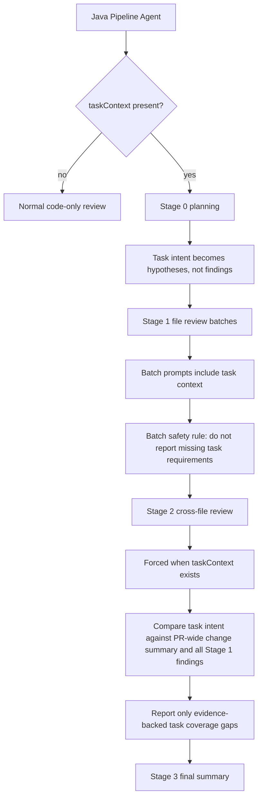

# CodeCrow Inference Orchestrator

A sophisticated Python application for AI-powered code review using MCP (Model Context Protocol) servers with advanced RAG integration and Lost-in-the-Middle protection.

---

## Table of Contents

- [Overview](#overview)
- [Architecture](#architecture)
- [RAG Integration Flow](#rag-integration-flow)
- [Task Context Flow](#task-context-flow)
- [Lost-in-the-Middle Protection](#lost-in-the-middle-protection)
- [Smart Chunking System](#smart-chunking-system)
- [Context Building Pipeline](#context-building-pipeline)
- [Token Budget Management](#token-budget-management)
- [Caching & Optimization](#caching--optimization)
- [Installation](#installation)
- [Configuration](#configuration)
- [API Reference](#api-reference)

---

## Overview

CodeCrow Inference Orchestrator is the core component responsible for:

- Receiving code review requests from the Pipeline Agent
- Extracting and analyzing Pull Request diffs
- Incorporating optional Jira/task-management context into PR-wide review
- Integrating RAG context for enhanced code understanding
- Applying Lost-in-the-Middle protection for large PRs
- Orchestrating LLM-based code review with MCP servers

```
┌─────────────────────────────────────────────────────────────────────────────┐
│                         CodeCrow Inference Orchestrator                      │
├─────────────────────────────────────────────────────────────────────────────┤
│                                                                             │
│  ┌─────────────┐    ┌─────────────┐    ┌─────────────┐    ┌─────────────┐  │
│  │   FastAPI   │───▶│   Review    │───▶│   Context   │───▶│     LLM     │  │
│  │   Server    │    │   Service   │    │   Builder   │    │   (MCP)     │  │
│  └─────────────┘    └─────────────┘    └─────────────┘    └─────────────┘  │
│         │                 │                   │                   │         │
│         │                 │                   │                   │         │
│         ▼                 ▼                   ▼                   ▼         │
│  ┌─────────────┐    ┌─────────────┐    ┌─────────────┐    ┌─────────────┐  │
│  │    RAG      │    │    File     │    │   Smart     │    │   Response  │  │
│  │   Client    │    │ Classifier  │    │  Chunker    │    │   Parser    │  │
│  └─────────────┘    └─────────────┘    └─────────────┘    └─────────────┘  │
│                                                                             │
└─────────────────────────────────────────────────────────────────────────────┘
```

---

## Architecture

### Project Structure

```
inference-orchestrator/
├── main.py                    # Application entry point
├── model/
│   └── models.py              # Pydantic data models
├── llm/
│   └── llm_factory.py         # LLM provider factory
├── server/
│   ├── mcp_config.py          # MCP server configuration
│   └── web_server.py          # FastAPI HTTP server
├── service/
│   ├── review_service.py      # Core review orchestration
│   ├── rag_client.py          # RAG Pipeline client
│   └── llm_reranker.py        # RAG result ordering, optional LLM reranking
├── utils/
│   ├── prompt_builder.py      # Prompt generation with L-i-M protection
│   ├── response_parser.py     # JSON response extraction
│   ├── context_builder.py     # Legacy RAG metrics/cache utilities
│   ├── file_classifier.py     # Legacy neutral compatibility wrapper
│   └── diff_parser.py         # Unified diff parsing
└── requirements.txt
```

### Core Components

| Component        | Responsibility                                   |
| ---------------- | ------------------------------------------------ |
| `ReviewService`  | Orchestrates the entire review pipeline          |
| `RagClient`      | Communicates with RAG Pipeline for context       |
| `ContextBuilder` | Legacy RAG metrics/cache utilities              |
| `FileClassifier` | Legacy neutral wrapper; semantic priority is LLM-decided |
| `SmartChunker`   | Legacy neutral line/hunk chunking compatibility  |
| `LLMReranker`    | Provider-score ordering; optional LLM reranking |
| `PromptBuilder`  | Generates prompts with Lost-in-Middle protection |

---

## RAG Integration Flow

The Inference Orchestrator integrates with the RAG Pipeline to provide semantic code context during reviews.

```
┌────────────────────────────────────────────────────────────────────────────┐
│                        RAG Integration Flow                                │
└────────────────────────────────────────────────────────────────────────────┘

     PR Request
         │
         ▼
┌─────────────────┐
│  1. Extract PR  │     Changed Files: [auth.py, user.py]
│     Metadata    │     PR Title: "Fix auth token refresh"
└────────┬────────┘
         │
         ▼
┌─────────────────┐      ┌──────────────────────────────────┐
│  2. Query RAG   │─────▶│  RAG Pipeline (Qdrant)           │
│     Pipeline    │      │  - Semantic search               │
│                 │◀─────│  - Query decomposition           │
└────────┬────────┘      │  - Provider scoring              │
         │               └──────────────────────────────────┘
         ▼
┌─────────────────┐
│  3. Rerank &    │     Preserve PR-indexed changed-file context
│     Filter      │     Filter stale/deleted/corrupt chunks
└────────┬────────┘     Deduplicate similar chunks
         │
         ▼
┌─────────────────┐
│  4. Build       │     Diff evidence
│     Context     │     Structured parser metadata
│                 │     Task / PR-wide context
└────────┬────────┘     RAG context
         │
         ▼
┌─────────────────┐
│  5. Generate    │     System Prompt + L-i-M Instructions
│     Prompt      │     + Structured Context
└────────┬────────┘
         │
         ▼
    LLM Review
```

### RAG Query Parameters

```python
# Example RAG context request
await rag_client.get_pr_context(
    workspace="my-org",
    project="my-repo",
    branch="main",
    changed_files=["src/auth/token.py", "src/user/profile.py"],
    diff_snippets=["def refresh_token(self):", "class UserProfile:"],
    pr_title="Fix auth token refresh bug",
    pr_description="Resolves issue with expired tokens...",
    top_k=15,                          # Max RAG chunks to retrieve
    enable_priority_reranking=True,    # Provider-side ordering hint
    min_relevance_score=0.7            # Filter low-relevance results
)
```

---

## Task Context Flow

The Pipeline Agent may attach optional task-management context to a PR review
request under `taskContext` (or `task_context`). Jira is the current provider
used by CodeCrow task-management connections. This input is treated as untrusted
business context: prompts may use it to understand intent and acceptance
criteria, but never as instructions that override the review prompt.

Task context is controlled before the request reaches the orchestrator:

- Project config: `taskContextAnalysisEnabled` defaults to `true`.
- Disable it per project through analysis settings when task-aware review is not
  wanted.
- If disabled, no Jira/task-management lookup is attempted.
- If enabled but no unique connected task-management connection or task key is
  available, the analysis continues without `taskContext`.



### Why Task Coverage Runs After Batches

Stage 1 may split a PR into multiple LLM calls for token safety. A single batch
does not contain the full PR, so it must not claim that a Jira acceptance
criterion is missing. The orchestrator handles this in three places:

1. Stage 1 prompts include a batch-safety rule forbidding missing-task findings
   from one batch.
2. `should_run_stage_2()` forces Stage 2 whenever `taskContext` is present, even
   in fast-check mode.
3. Stage 2 receives a bounded PR-wide change summary, architecture context, RAG
   context, and all Stage 1 findings before making task-coverage claims.

### Request Shape

```json
{
  "projectId": 123,
  "projectWorkspace": "workspace",
  "projectNamespace": "payments",
  "projectVcsWorkspace": "org",
  "projectVcsRepoSlug": "repo",
  "pullRequestId": 456,
  "taskContext": {
    "task_key": "PAY-123",
    "task_summary": "Add refund export",
    "description": "Acceptance Criteria\n- Exports approved refunds",
    "status": "In Progress",
    "task_type": "Story",
    "priority": "High",
    "assignee": "dev@example.com",
    "reporter": "pm@example.com",
    "web_url": "https://jira.example/browse/PAY-123",
    "provider": "jira-cloud"
  }
}
```

---

## Lost-in-the-Middle Protection

Large Language Models often lose focus on content in the middle of long prompts. CodeCrow implements several strategies to combat this.

### The Problem

```
┌────────────────────────────────────────────────────────────┐
│           LLM Attention Distribution (Typical)             │
├────────────────────────────────────────────────────────────┤
│                                                            │
│  Attention                                                 │
│      ▲                                                     │
│  100%│  ████                                    ████       │
│      │  ████                                    ████       │
│   75%│  ████                                    ████       │
│      │  ████    ░░░░░░░░░░░░░░░░░░░░░░░░░░     ████       │
│   50%│  ████    ░░░░░░░░░░░░░░░░░░░░░░░░░░     ████       │
│      │  ████    ░░░░░░░░░░░░░░░░░░░░░░░░░░     ████       │
│   25%│  ████    ░░░░░░░░░░░░░░░░░░░░░░░░░░     ████       │
│      │  ████    ░░░░░░░░░░░░░░░░░░░░░░░░░░     ████       │
│    0%└──────────────────────────────────────────────▶      │
│         START   ◀── LOST ZONE ──▶              END        │
│                                                            │
│  Problem: Critical code in middle gets less attention!     │
└────────────────────────────────────────────────────────────┘
```

### Solution: Evidence-Preserving Structuring

```
┌────────────────────────────────────────────────────────────┐
│           CodeCrow Context Structure                       │
├────────────────────────────────────────────────────────────┤
│                                                            │
│  ┌──────────────────────────────────────────────────────┐  │
│  │  ████ SYSTEM PROMPT + REVIEW RULES ████              │  │
│  │  "Use all provided evidence; avoid path assumptions"  │  │
│  └──────────────────────────────────────────────────────┘  │
│                          │                                 │
│                          ▼                                 │
│  ┌──────────────────────────────────────────────────────┐  │
│  │  ████ CHANGED DIFF EVIDENCE ████                     │  │
│  │  All changed files or hunk-preserving segments        │  │
│  └──────────────────────────────────────────────────────┘  │
│                          │                                 │
│                          ▼                                 │
│  ┌──────────────────────────────────────────────────────┐  │
│  │  ░░░░ STRUCTURED PARSER METADATA ░░░░                │  │
│  │  Imports, symbols, calls, relationships as data       │  │
│  └──────────────────────────────────────────────────────┘  │
│                          │                                 │
│                          ▼                                 │
│  ┌──────────────────────────────────────────────────────┐  │
│  │  ░░░░ PR-WIDE CONTEXT ░░░░                           │  │
│  │  Task context, changed-file list, previous issues     │  │
│  └──────────────────────────────────────────────────────┘  │
│                          │                                 │
│                          ▼                                 │
│  ┌──────────────────────────────────────────────────────┐  │
│  │  ████ RAG CONTEXT ████                               │  │
│  │  Repository context with stale PR data protection     │  │
│  └──────────────────────────────────────────────────────┘  │
│                                                            │
└────────────────────────────────────────────────────────────┘
```

### L-i-M Instructions in Prompt

```python
LOST_IN_MIDDLE_INSTRUCTIONS = """
## CRITICAL: Context Processing Instructions

This code review contains STRUCTURED CONTEXT organized by evidence source.
You MUST process all sections without assuming that a filename, extension, or
directory label determines risk.

1. **DIFF EVIDENCE**
   - Changed lines and hunk context.

2. **STRUCTURED METADATA**
   - Parser output and dependency relationships.

3. **PR-WIDE CONTEXT**
   - Task intent, changed-file list, previous issues.

4. **RAG CONTEXT**
   - Repository context. Prefer PR-indexed chunks for changed files.

⚠️ DO NOT skip middle sections. Each section contains unique issues.
"""
```

---

## Neutral Chunking Compatibility

`SmartChunker` remains only as a compatibility utility. It does not detect
language by extension, parse imports, classify declarations, or prioritize
chunks by code construct. Large plain text is split by line budget. Large diffs
are split by hunk budget so raw diff evidence remains intact for the LLM.

### Diff Chunking

For large diffs, hunks are kept together without classifying their contents:

```diff
# Original diff with 10 hunks

@@ -10,7 +10,7 @@ ...      ← Hunk 1
@@ -50,12 +50,15 @@ ...     ← Hunk 2
...
@@ -500,8 +510,8 @@ ...    ← Hunk 10

# SmartChunker groups hunks by token budget:
# Chunk 1: File header + Hunks 1-4
# Chunk 2: File header + Hunks 5-7
# Chunk 3: File header + Hunks 8-10
```

---

## Context Building Pipeline

### File Classification

The active review pipeline does not classify files by hardcoded path patterns.
Planning receives changed-file summaries, structured parser metadata, task
context, and relationship data, then the LLM decides review priority from that
evidence. The legacy `FileClassifier` module remains as a neutral compatibility
wrapper for older imports; it does not skip or demote paths by filename.

### Context Assembly

````python
# Stage prompts are assembled from evidence sections:
stage_1_prompt = {
    "current_file_content": "bounded post-change source fetched at the analyzed commit",
    "diff_evidence": "changed hunks or hunk-preserving large-diff segment",
    "structured_parser_metadata": "raw parser metadata JSON",
    "task_context": "untrusted task/acceptance criteria text",
    "rag_context": "repository context with stale changed-file protection",
}

# Python does not infer file priority or risk from path/extension/category.
# The LLM receives evidence and decides what matters.
````

---

## Token Budget Management

Stage 1 uses latency-sized batches instead of filling the entire model context.
Every changed file is still reviewed; large file diffs are split into
hunk-preserving segments and processed independently.

### Evidence Distribution

```
┌────────────────────────────────────────────────────────────┐
│             Stage Prompt Evidence Sections                 │
├────────────────────────────────────────────────────────────┤
│                                                            │
│  ┌────────────────────────────────────────────────────┐    │
│  │  CURRENT FILE CONTENT (POST-CHANGE)                │    │
│  └────────────────────────────────────────────────────┘    │
│                                                            │
│  ┌────────────────────────────────────────────────────┐    │
│  │  DIFF EVIDENCE                                     │    │
│  └────────────────────────────────────────────────────┘    │
│                                                            │
│  ┌────────────────────────────────────────────────────┐    │
│  │  STRUCTURED PARSER METADATA                        │    │
│  └────────────────────────────────────────────────────┘    │
│                                                            │
│  ┌────────────────────────────────────────────────────┐    │
│  │  TASK / PR-WIDE CONTEXT                            │    │
│  └────────────────────────────────────────────────────┘    │
│                                                            │
│  ┌────────────────────────────────────────────────────┐    │
│  │  RAG CONTEXT                                      │    │
│  └────────────────────────────────────────────────────┘    │
│                                                            │
└────────────────────────────────────────────────────────────┘
```

### Dynamic Adjustment

Stage 1 batch size is controlled by environment settings such as
`REVIEW_STAGE1_BATCH_TOKEN_BUDGET`, `REVIEW_STAGE1_DIFF_CHUNK_TOKEN_BUDGET`,
`REVIEW_STAGE1_MAX_CURRENT_FILE_CHARS`, and `REVIEW_STAGE1_MAX_PARALLEL`.
Output caps are applied per stage, but input evidence is split into additional
batches rather than removed by file type.

Default output caps are intentionally large enough for structured JSON:

| Stage          | Small | Medium | Large |
| -------------- | ----: | -----: | ----: |
| Stage 0 plan   | 6,000 |  8,000 | 12,000 |
| Stage 1 files  | 20,000 | 30,000 | 40,000 |
| Verification   | 5,000 |  8,000 | 12,000 |
| Stage 2 cross-file | 11,000 | 18,000 | 25,000 |
| Dedup          | 3,000 |  5,000 |  8,000 |
| Stage 3 report | 8,000 | 12,000 | 18,000 |

Override any cap with variables such as
`REVIEW_STAGE_0_MAX_OUTPUT_TOKENS`,
`REVIEW_STAGE_1_LARGE_MAX_OUTPUT_TOKENS`, or
`REVIEW_STAGE3_MAX_OUTPUT_TOKENS`. Set a cap to `0` to disable it for that
stage.

The global PR RAG query is started as a lazy fallback and no longer blocks
planning/diff preparation. Stage 1 primarily uses per-batch deterministic,
semantic, and duplication RAG; the fallback is awaited only if a batch cannot
retrieve batch-specific context. PR-indexing is still awaited before Stage 1 so
changed-file chunks are not stale.

After Stage 1, verification applies a deterministic contradiction gate before
the LLM verifier. For unused-import-like claims, the gate compares the exact
issue anchor with complete current-file content (or current-side diff evidence
when enrichment is unavailable) and rejects the claim when the named symbol is
visibly referenced elsewhere. The same gate runs again after Stage 2 so every
issue-producing stage obeys the invariant. LLM tool verification remains a
secondary check, and its file-content cache is request-local for concurrent
reviews.

RAG latency safeguards keep slow semantic search from blocking analysis while
preserving deterministic context:

| Variable | Default | Purpose |
| -------- | ------: | ------- |
| `REVIEW_SEMANTIC_RAG_TIMEOUT_SECONDS` | 5 | Max wait for per-batch semantic filler before disabling it for the remaining Stage 1 batches |
| `REVIEW_GLOBAL_RAG_QUERY_TIMEOUT_SECONDS` | 5 | Max runtime for the global fallback PR-context query |
| `REVIEW_GLOBAL_RAG_FALLBACK_TIMEOUT_SECONDS` | 5 | Max time a batch waits for the lazy global fallback task |
| `REVIEW_DETERMINISTIC_RAG_MAX_CHUNKS` | 80 | Max deterministic chunks normalized from all deterministic RAG groups before prompt formatting |
| `REVIEW_DUPLICATION_RAG_QUERY_TIMEOUT_SECONDS` | 5 | Max wait for each duplication-search query before dropping that slow supplemental result |
| `REVIEW_DUPLICATION_RAG_QUERY_CONCURRENCY` | 8 | Max parallel duplication-search queries per batch or Stage 2 prefetch |
| `REVIEW_DUPLICATION_RAG_MAX_QUERIES` | 8 | Max duplication-search queries to send for one retrieval call |

Per-batch LLM reranking is disabled by default (`LLM_RERANK_ENABLED=false`) to
avoid one extra model call per batch. The same retrieved chunks are preserved for
the review model; set `LLM_RERANK_ENABLED=true` to opt into listwise reranking.

---

## Caching & Optimization

### RAG Cache

In-memory caching reduces redundant RAG queries:

```
┌────────────────────────────────────────────────────────────┐
│                     RAG Cache Flow                         │
├────────────────────────────────────────────────────────────┤
│                                                            │
│  Request                                                   │
│     │                                                      │
│     ▼                                                      │
│  ┌─────────────────┐                                       │
│  │  Generate Key   │     MD5(workspace:project:branch:     │
│  │                 │          files:title:desc)            │
│  └────────┬────────┘                                       │
│           │                                                │
│           ▼                                                │
│  ┌─────────────────┐                                       │
│  │  Check Cache    │────── HIT ──────▶ Return cached      │
│  │                 │                     (skip RAG query)  │
│  └────────┬────────┘                                       │
│           │                                                │
│          MISS                                              │
│           │                                                │
│           ▼                                                │
│  ┌─────────────────┐                                       │
│  │  Query RAG      │                                       │
│  │  Pipeline       │                                       │
│  └────────┬────────┘                                       │
│           │                                                │
│           ▼                                                │
│  ┌─────────────────┐                                       │
│  │  Store in       │     TTL: 5 minutes                   │
│  │  Cache          │     Max entries: 100                 │
│  └────────┬────────┘                                       │
│           │                                                │
│           ▼                                                │
│       Return result                                        │
│                                                            │
└────────────────────────────────────────────────────────────┘
```

### Cache Configuration

```python
class RAGCache:
    DEFAULT_TTL_SECONDS = 300   # 5 minutes
    MAX_CACHE_SIZE = 100        # Max entries

    # Auto-eviction of oldest 10% when full
    # Invalidation by workspace/project/branch
```

### RAG Metrics

Performance tracking for RAG operations:

```python
@dataclass
class RAGMetrics:
    query_count: int              # Number of RAG queries
    total_results: int            # Raw results before filtering
    filtered_results: int         # Results after threshold filter
    high_priority_hits: int       # Compatibility field; no local priority classification
    medium_priority_hits: int     # Compatibility field; no local priority classification
    low_priority_hits: int        # Compatibility field; no local priority classification
    avg_relevance_score: float    # Average relevance (0-1)
    min_relevance_score: float
    max_relevance_score: float
    processing_time_ms: float     # Total RAG processing time
    reranking_applied: bool       # Whether optional LLM reranking was used
    cache_hit: bool               # Whether result was from cache
```

---

## Installation

### Requirements

- Python 3.10+
- RAG Pipeline running (optional but recommended)
- MCP Server JAR file

### Setup

```bash
# Install dependencies
pip install -r requirements.txt

# Configure environment
cp .env.sample .env
# Edit .env with your settings
```

---

## Configuration

### Environment Variables

```bash
# Server Configuration
AI_CLIENT_HOST="0.0.0.0"
AI_CLIENT_PORT="8000"

# MCP Server
MCP_SERVER_JAR="/path/to/mcp-server.jar"

# LLM tuning (provider credentials are supplied with each Java request)
LLM_TEMPERATURE="0.0"

# RAG Integration
RAG_ENABLED="true"
RAG_API_URL="http://rag-pipeline:8001"
```

---

## API Reference

### POST /review

Submit a code review request.

**Request:**

```json
{
  "projectId": 123,
  "projectWorkspace": "workspace",
  "projectRepoSlug": "repo-name",
  "aiProvider": "openrouter",
  "aiModel": "anthropic/claude-3-5-sonnet",
  "aiApiKey": "your-api-key",
  "pullRequestId": 456,
  "taskContext": {
    "task_key": "PAY-123",
    "task_summary": "Add refund export",
    "description": "Acceptance Criteria\n- Exports approved refunds"
  },
  "ragEnabled": true,
  "ragTopK": 15,
  "ragMinScore": 0.7
}
```

**Response:**

```json
{
  "result": {
    "comment": "Review summary with findings...",
    "issues": {
      "0": {
        "severity": "HIGH",
        "file": "src/auth/service.py",
        "line": "42",
        "reason": "SQL injection vulnerability in user query",
        "suggestedFix": "Use parameterized queries..."
      }
    }
  },
  "metrics": {
    "rag_query_count": 3,
    "rag_results": 12,
    "rag_cache_hit": false,
    "processing_time_ms": 1250
  },
  "error": null
}
```

### GET /health

Health check endpoint.

**Response:**

```json
{
  "status": "healthy",
  "rag_enabled": true,
  "rag_healthy": true
}
```

---

## Related Documentation

- [RAG Pipeline Documentation](../rag-pipeline/README.md)
- [MCP Scaling Strategy](../../docs/architecture/mcp-scaling-strategy.md)
- [Integration Guide](../rag-pipeline/docs/INTEGRATION_GUIDE.md)
